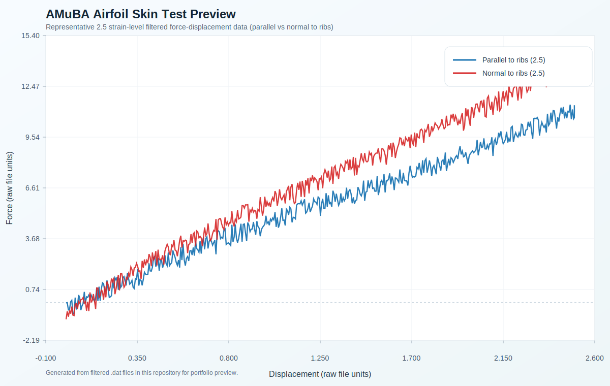
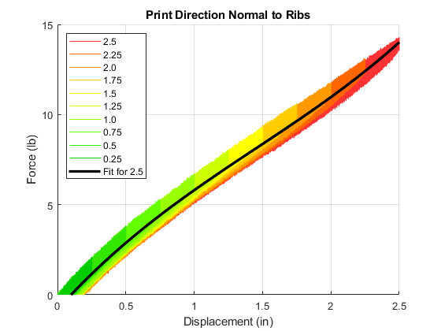
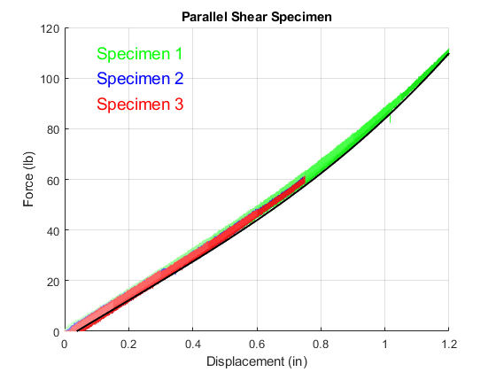
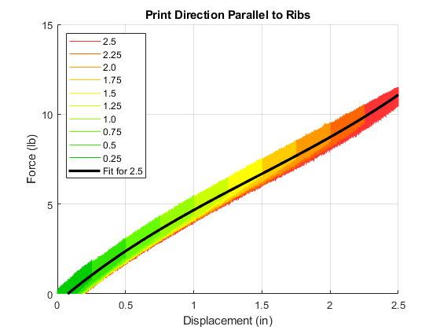
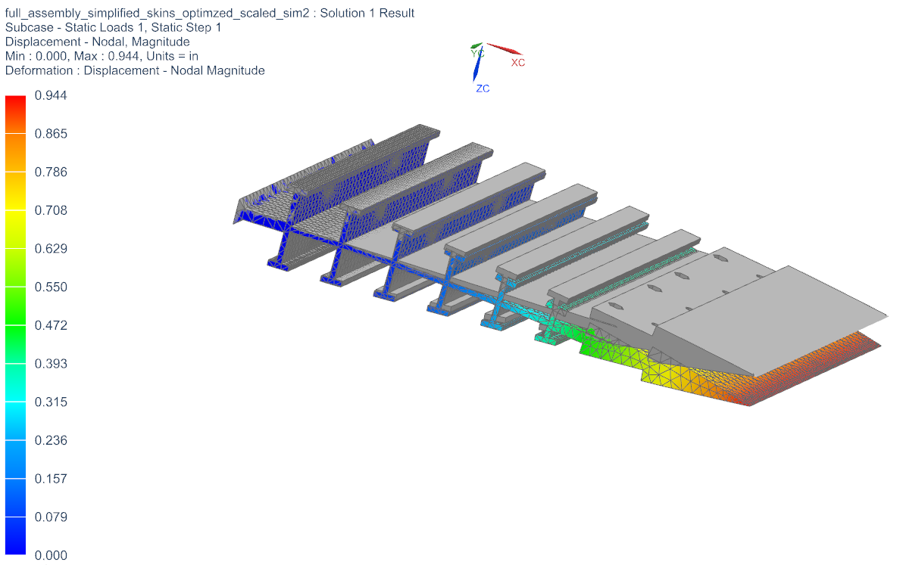
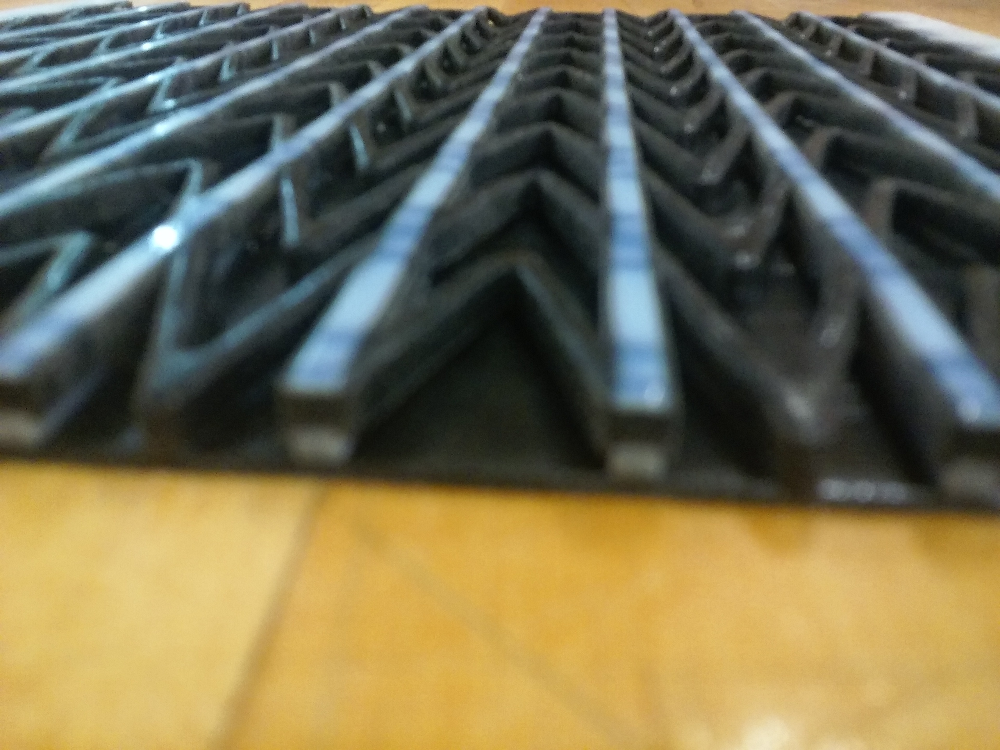
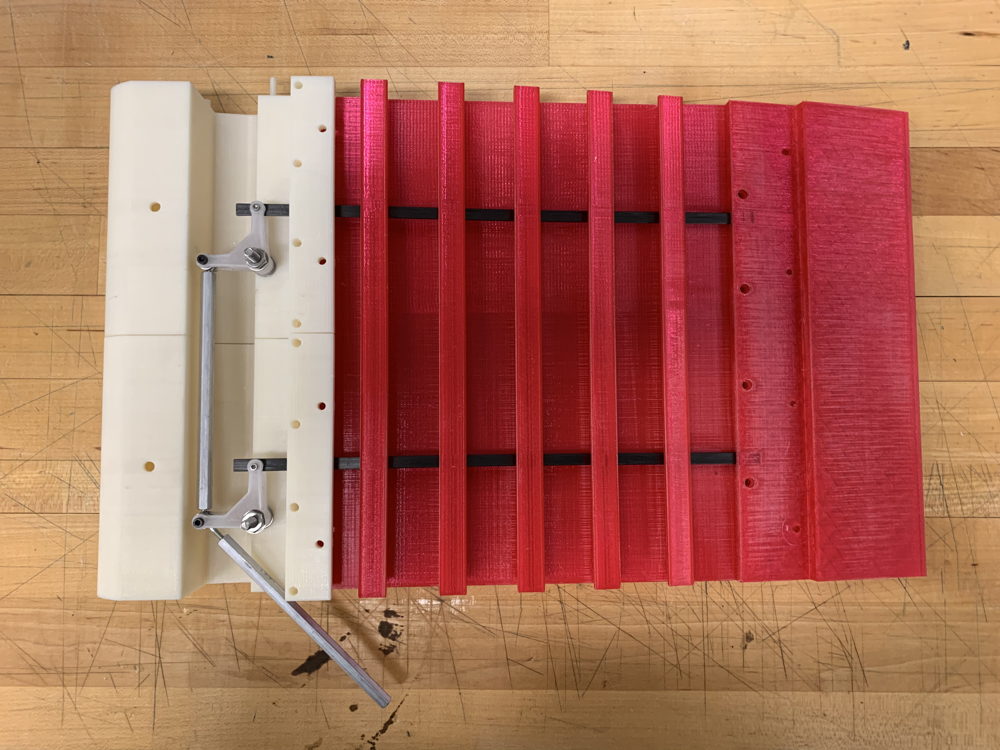
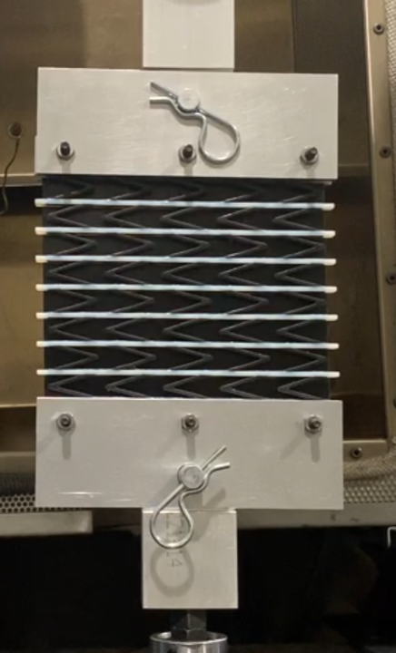

# MATLAB Multimaterial Airfoil Skin Test Data

MATLAB scripts and experimental datasets for multimaterial testing, including airfoil skin shear/skin test data.

## Context

This dataset is associated with the NASA AMuBA (Aeroservoelastic Multifidelity Design of Biomimetic Aircraft) project work completed as undergraduate research in UMD's Aerospace Composites Research Laboratory (Summer 2019)

## Contents

- `shear_data/` raw/processed shear test exports and import scripts
- `skin_data/` filtered airfoil skin test data, import scripts, and fit scripts

## Notes

- `skin_data/README.txt` contains original notes about filename suffixes and MATLAB import usage.
- `skin` in this dataset refers to the outer skin of an airfoil, not biomaterials/biological tissue.
- This repository combines import scripts, fitting scripts, and preserved test data for reproducible analysis workflows.
- Instrument export metadata files (`.log`, `.mpp`, `.mps`, `.prm`) are currently preserved for completeness.

## Quick Start (MATLAB)

1. Open MATLAB in the repo root.
2. For airfoil skin tests, change into either `skin_data/normal_skin_test_data_filtered/` or `skin_data/parallel_skin_test_data_filtered/`.
3. Run the folder-level import script (`import_datan.m` or `import_datap.m`) to load all filtered datasets and generate comparison plots.
4. Run `fit.m` in the same folder for the symbolic curve-fit workflow built on the imported `x*` tables and the `*_fit` coefficients.
5. For shear tests, change into `shear_data/` and run `import_shear_data.m` (it calls the subfolder import scripts for dull/shiny replicates and plots fitted curves).
6. If relative path errors occur, make sure MATLAB's current folder matches the script's folder before running `run(...)`-based import scripts.

## Dependencies / Compatibility Notes

- `fit.m` scripts use Symbolic Math (`syms`, `equationsToMatrix`).
- `parallel_skin_test_data_filtered/import_datap.m` uses `NonLinearModel.fit` (Statistics and Machine Learning Toolbox in older MATLAB versions).
- Some import scripts were auto-generated and include Windows path comments; the active `filename` paths are relative and work if run from the correct folder.

## Data Notes

- `filtered.dat` files are the primary processed inputs used by the plotting/fitting scripts.
- `specimen.dat` and associated instrument metadata files preserve the original test exports and run configuration context.

## AMuBA Figures and Photos

- Plot figures: `assets/amuba_figures/`
- Photos and test imagery: `assets/amuba_photos/`
- Analysis preview: `assets/amuba_airfoil_skin_force_displacement_preview.svg`

### Analysis Preview

### Figures

### Photos / Test Images

